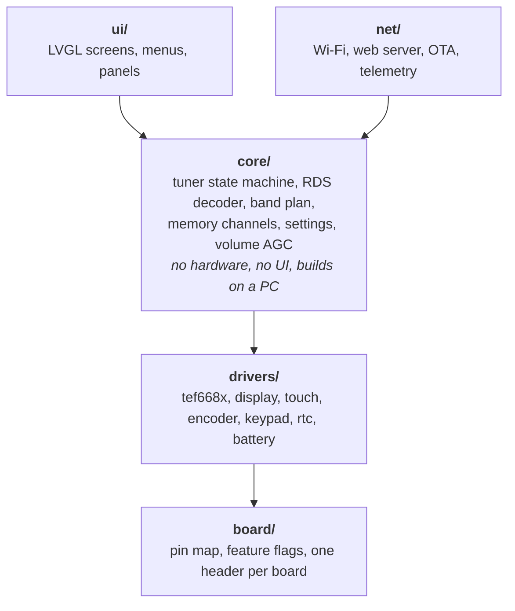
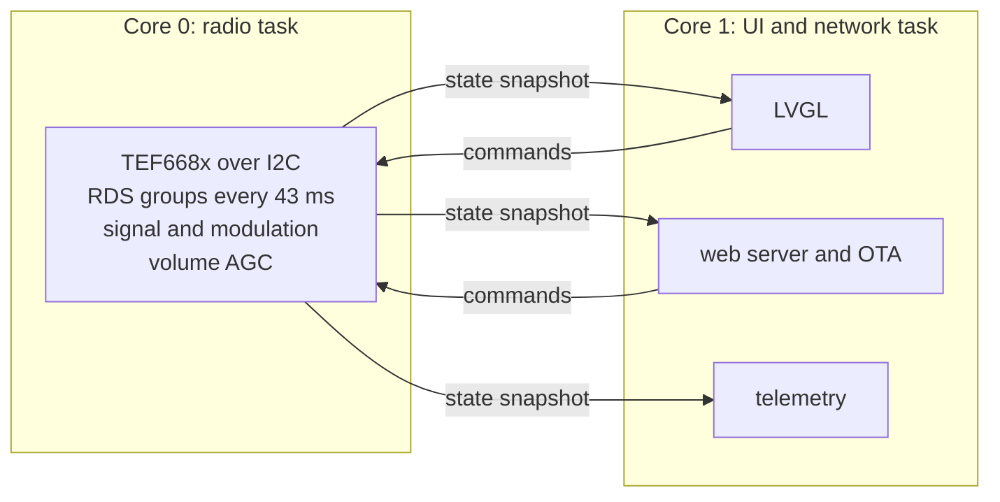
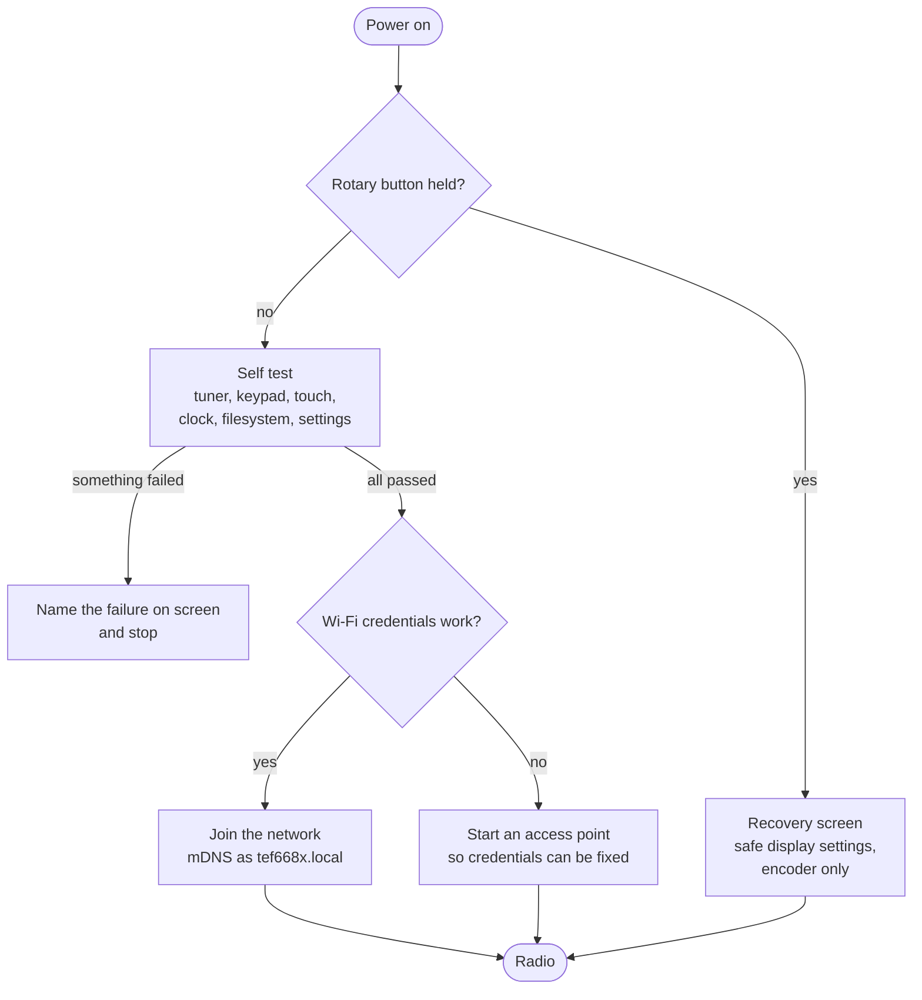

# tef668x-esp32

Firmware for radio receivers built around the NXP TEF668x tuner and an ESP32.

The first supported board is the **ATS-125**, a portable FM and AM receiver with
an ILI9341 320x240 touch display. The code is structured so other TEF668x radios
can be added as a board header and a build environment, without touching the
application.

> **Status: it receives.** The radio tunes FM and AM, and is flashed and driven over Wi-Fi. There is no display, no encoder and no buttons yet, so today it is controlled from a browser or from `curl`. The design is settled in [DECISIONS.md](DECISIONS.md), the build order is in [ROADMAP.md](ROADMAP.md), and the proposed screens, type scale and palette are in [docs/design.html](docs/design.html).

## What works today

Phases 0 and 1 are done and phase 2 is most of the way through.

| | |
|---|---|
| Wi-Fi | Joins a network, or starts its own access point when the stored credentials do not work |
| Updates | Over the air from the browser. Two application slots, and the bootloader rolls back an image that will not boot |
| Web page | Status, Wi-Fi setup, PIN change and firmware upload, behind a six digit access PIN |
| Tuner | TEF6686 brought up with its patch, FM and AM, bandwidth, volume, mute and signal readings |
| Band plan | FM, OIRT, LW, MW and SW, with every step size and both band edges |
| Control API | Every control the radio has, over HTTP. See below |

Not built yet: the display, touch, the encoder, the keypad, RDS, memory channels, the volume AGC, telemetry, the spectrum and the clock. Those are phases 3 to 6.

## The control API

Reads are open. Writes need the access PIN, which is sent once to `/auth` and comes back as a session cookie.

```bash
R=http://tef668x.local
curl -s $R/api/state                       # everything, as JSON. No PIN needed
curl -s -c jar -d 'pin=000000' $R/auth     # sign in, keep the session cookie
curl -s -b jar -d 'khz=102800' $R/api/tune # FM 102.80 MHz
curl -s -b jar -d 'steps=-1'   $R/api/step # one step down
curl -s -b jar -d 'band=MW'    $R/api/band
```

The rest are `/api/bandwidth`, `/api/step-size`, `/api/volume`, `/api/mute`, `/api/mode`, `/api/cycle`, `/api/squelch`, `/api/fm`, `/api/seek`, `/api/settings` and `/api/save`. Every reply names the state the radio actually reached, and a refusal says why in plain words. Decision 25 is the rule: if the screen can do it, the API can do it.

Everything the radio is set to is held in one place and changed through the endpoints above, which act at once. `POST /api/save` writes what it is set to now into NVS, so it comes up that way next time. `GET /api/settings` says what is stored, which is not always what it is set to now, and `POST /api/settings` takes the four that can only be read at start up: the FM band plan, the medium wave spacing, and which encoder is fitted and which way round.

The same settings are on the web page, as forms that post to these endpoints rather than to handlers of their own. Each form offers only what the band the radio is on can actually take, so a press can never reach a setting the API would refuse.

This is how the radio is tested. A script can tune it across a band edge and read back what happened, with nobody standing at it.

## What it will do

The whole target, not a description of today.

| | |
|---|---|
| Bands | FM, OIRT, LW, MW, SW |
| RDS | PS, RT, PTY, PI, alternative frequencies |
| Display | LVGL. A layout per band, so AM does not waste a third of the screen on empty RDS fields |
| Input | Rotary encoder, keypad and touch. Touch is a setting, not a separate build |
| Memory | 99 channels, editable in a browser, CSV import and export |
| Volume AGC | Levels off the loudness difference between stations, measured from modulation depth |
| Web interface | Settings, memory channels, spectrum, diagnostics, firmware upload |
| Updates | Over the air from the browser or from a GitHub release, with rollback |
| Telemetry | Live state as JSON over UDP and over a websocket |
| Spectrum | Band sweep plotted on the radio and in the browser, stored with a timestamp |
| Clock | NTP and an RTC, with a sleep timer and an alarm |

## How it is put together

Five layers, with one rule: **the core must not know a screen exists.** Arrows
point the way dependencies are allowed to go. Nothing points back up.



Because `core/` depends on nothing below it except through interfaces, the whole
of it compiles and runs on a laptop. That is where the RDS decoder, the band
plan and the volume AGC are tested, with no radio attached.

## How it runs

Two FreeRTOS tasks, one per core. They never share a variable. The radio task
publishes a snapshot of its state, and takes commands off a queue.



This is why a slow web request cannot make the radio drop RDS groups, and why
opening a menu does not stop the web server. In the firmware this replaces, both
of those happen, because everything runs in one cooperative loop.

## How it boots



Two things this picture is really about. A failed self test names what failed
instead of hanging. And wrong Wi-Fi credentials start an access point rather
than forcing a cable flash. Before any of this runs, the bootloader has already
rolled back to the previous firmware if the current one failed to boot.

The rollback, the Wi-Fi branch and the tuner part of the self test work today.
The recovery screen and the rest of the self test need the display and the
encoder, which are phase 4.

## Hardware

Everything known about the ATS-125 is in [HARDWARE.md](HARDWARE.md): chip, pin
map, I2C addresses, part markings read off the board, and the flash layout.

In short: ESP32-D0WD-V3 in a WROOM-32U class module, 8MB flash, no PSRAM, a
TEF6686 tuner on I2C, an ILI9341 display with an XPT2046 touch controller, and a
PCA9555 driving the keypad.

## Building

```bash
pio run -e ats125                 # build
pio run -e native -t test         # unit tests, no hardware needed
pio run -e ats125 -t upload       # first flash, over USB
```

The first USB flash needs the board in download mode: hold BOOT, tap RESET,
release BOOT. Everything after that goes over Wi-Fi, either from the upload form
on the radio's own page or with `pio run -e ats125 -t upload --upload-port <ip>`.

## Contributing

`master` is released code. Work happens on `dev`. Everything is checked by one
command:

```bash
tools/check.sh
```

That builds, runs the unit tests, checks coverage on `core/` against a floor,
runs static analysis, checks formatting and doc comments, and prints the image
size. CI runs the same script, so a green run locally means the same thing.

[RULES.md](RULES.md) has the way of working, [DECISIONS.md](DECISIONS.md) has
what was settled about the radio and why, and
[docs/test-checklist.md](docs/test-checklist.md) has the manual checks CI cannot
do.

## Licence

GPLv3.

This project takes its hardware knowledge and many of its ideas from
[PE5PVB/TEF6686_ESP32](https://github.com/PE5PVB/TEF6686_ESP32) by Sjef
Verhoeven, PE5PVB, which is GPLv3. It shares no source code with it. It is a
rewrite, not a fork.
