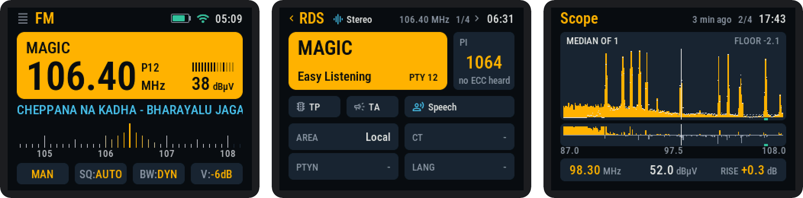
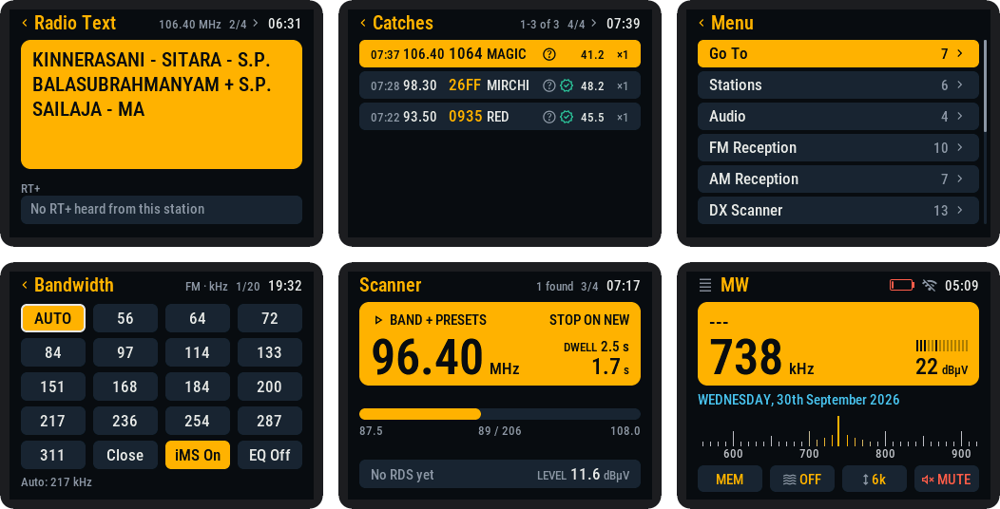
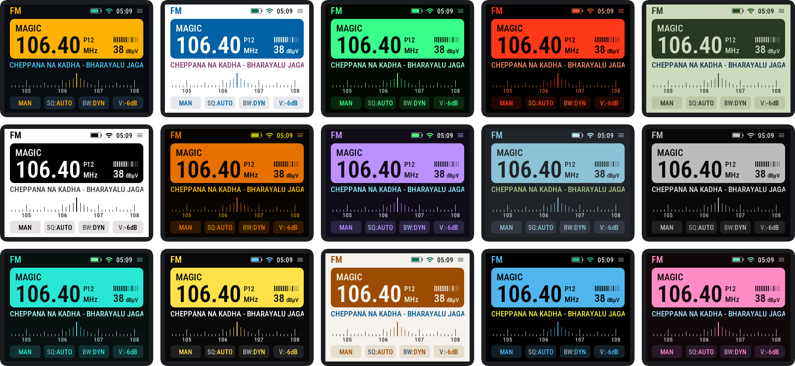
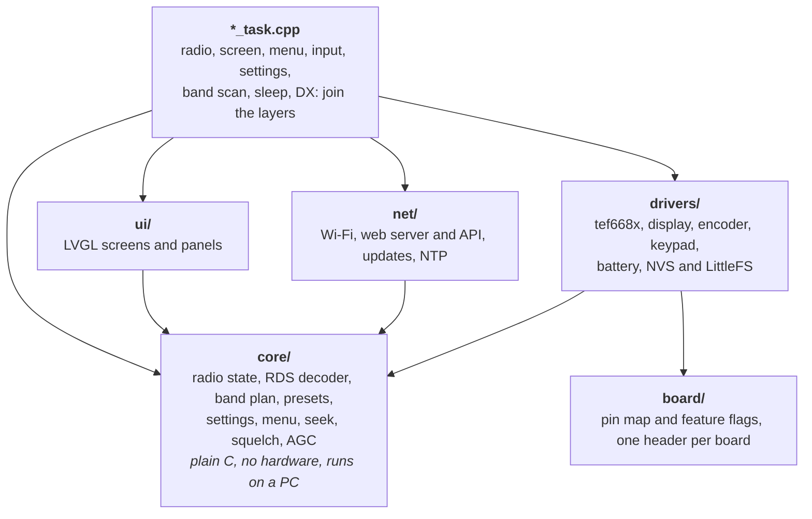
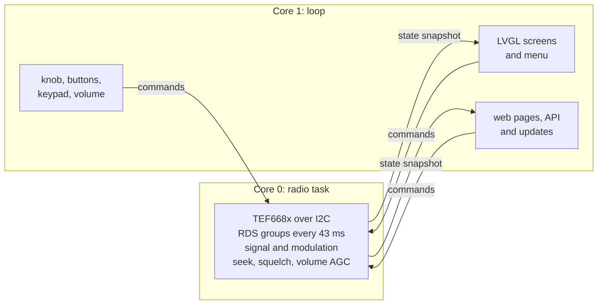
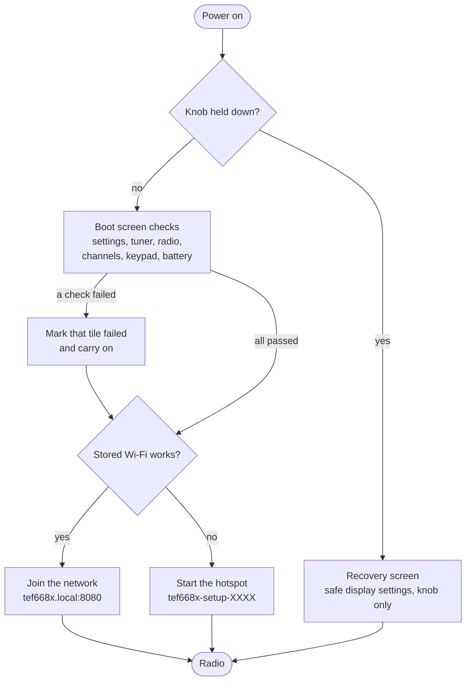
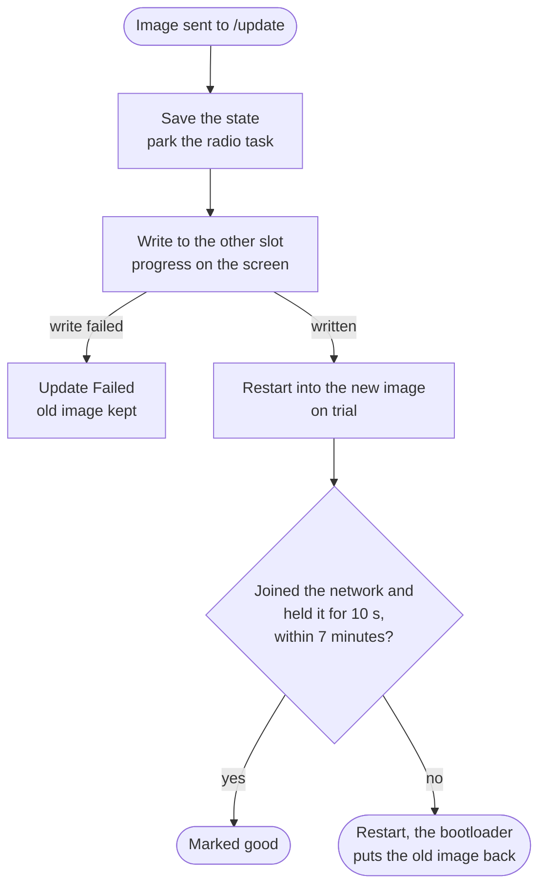

# TEF6686X - ESP32

Open source firmware for radio receivers built around the NXP TEF668x tuner and an ESP32.

The first supported radio is the **ATS-125**, a portable FM and AM receiver with a 320x240 colour display. The code keeps every board detail in one header, so another TEF668x radio can be added as a new board header and a build environment, without touching the rest.



> **Status:** it works as a full radio today. FM and AM, seek, squelch, RDS, 99 presets, band scan, logbook, DX mode, network clock, a three level menu, a browser page, an HTTP control API and over the air updates with rollback. Touch works on the radio screen and the menu's lists. Still to come: touch on the other screens, other screen layouts, live telemetry and a spectrum view.

This is a ground up rewrite, not a fork. It takes its hardware knowledge and many ideas from [PE5PVB/TEF6686_ESP32](https://github.com/PE5PVB/TEF6686_ESP32), and shares no code with it, apart from the tuner's patch data listed under [Licence](#licence).

## Features

**Reception**
- FM, OIRT, LW, MW and SW, with every step size and both band edges.
- Filter width per band, automatic on FM, with iMS and the channel equaliser.
- Weak signal blends, both noise blankers, forced mono and de-emphasis.
- Seek that stops on a station and not on noise, with thresholds measured off a real radio.
- Squelch: Off, Auto, or Manual with the volume knob setting the level.
- Volume AGC that levels one station against the next.
- Each band remembers its own frequency, width and step, across a power cycle.

**RDS**
- Station name, radio text, programme type, PI and the traffic flags.
- RT+ title and artist, alternative frequencies, EON and the clock time.
- A name a station splits across two passes is joined back together.
- A field is shown only after it has been received twice the same way, so a half arrived name never shows.
- Four RDS pages: the station, the radio text, the networks, and the decoder's last minute with the block error rates.
- North America mode reads the PI as call letters and uses the RBDS programme types.

**DX mode**
- A page with the station as heard, the PI, how sure the decoder is, the country, six readings and a minute of signal history.
- A scanner that walks the band and stops on a station never caught before.
- A band scope: a level sweep of the whole band in about 4 s, with a baseline and the rise over it.
- A catches list, and new stations written to the logbook on their own.
- While DX mode is open, the presets are watched in the background, with a beep when one comes up.

**Presets and logbook**
- 99 presets, each with a band, a frequency, a width and a name, walked with the knob.
- Import and export as CSV, so a band plan can be made in a spreadsheet.
- A station scan per band that fills the empty presets.
- A 250 entry logbook: hold the knob and the radio writes down the time, frequency, signal and RDS name.

**Screen**
- LVGL, drawn with Roboto Condensed, in fifteen themes, plus a custom one.
- A day theme and a night theme that change with the clock.
- Every text colour meets a 4.5:1 contrast against its background, checked by a test.
- A boot screen that shows each start up check as it passes.
- A recovery screen: hold the knob down at power on.

**Network**
- Joins your Wi-Fi, or starts its own hotspot when it cannot.
- A web page served by the radio itself, with no internet needed.
- An HTTP control API for every control the radio has.
- Over the air updates with two firmware slots. A new image that fails to boot is rolled back on its own.
- Optional update check: the radio looks for a newer GitHub release at start and installs it when you say yes, after checking its size and sha256.
- Network time with a settable UTC offset.

**Power**
- Auto off after a set time, with a fade out and a deep sleep. A knob press wakes it.
- The panel dims when left alone. The first key press or knob turn only wakes it.
- The volume ramps instead of clicking.

## Screens

Every picture here comes from the firmware's own drawing code, run on a PC by `tools/screenshot.sh`. So each one shows exactly what the radio draws.



The fifteen themes:



More pictures, one per screen, are in [assets/screens](assets/screens) and [assets/themes](assets/themes).

## Hardware

The ATS-125:

| Part | What it is |
|---|---|
| Processor | ESP32-D0WD-V3 in a WROOM-32U class module, 8 MB flash, no PSRAM |
| Tuner | NXP TEF6686 on I2C |
| Display | ILI9341, 320x240, with an XPT2046 touch controller |
| Keypad | Through a PCA9555 I/O expander |
| Controls | Tuning knob with a push, BAND, BW and MODE buttons, a keypad with ENTER and DX, and a volume knob |

The pin map and the feature flags are in `src/board/board_ats125.h`.

## Building and flashing

Each [release](https://github.com/zeevy/tef668x-esp32/releases) has ready made files: `firmware-ats125-full.bin` for a first install over USB, written at address 0 with esptool, and `firmware-ats125.bin` for updates over Wi-Fi.

To build it yourself, you need [PlatformIO](https://platformio.org/). The checks in `tools/check.sh` also need gcovr and clang-format at these exact versions:

```bash
pip install platformio==6.2.0 gcovr==8.6 clang-format==23.1.1
```

```bash
pio run -e ats125                 # build the firmware
pio test -e native                # run the unit tests on your computer
pio run -e ats125 -t upload       # first flash, over USB
```

**The first flash needs download mode.** The ATS-125's USB serial chip is not wired for auto reset. Hold BOOT, tap RESET, release BOOT, then start the upload.

**After that, flash over Wi-Fi.** Open the radio's page, sign in with the PIN, and use the update form. Or with curl:

```bash
R=http://tef668x.local:8080
curl -s -c jar -d pin=000000 $R/auth
curl -s -b jar -F firmware=@.pio/build/ats125/firmware.bin $R/update
```

The radio saves its state, shows the progress on the screen and restarts. If the new image does not boot and join the network, the radio goes back to the old one by itself.

## First start

1. With no Wi-Fi stored, the radio starts an open hotspot named `tef668x-setup-XXXX`.
2. Join it and open `http://192.168.4.1:8080`. Enter your Wi-Fi name and password.
3. The radio joins your network and is then at `http://tef668x.local:8080`. Menu > Connectivity > Network Info shows the address.
4. The access PIN starts as `000000`. Change it under Connectivity > Web PIN, or on the web page.

**The hotspot has no password.** It is meant for setting up Wi-Fi. With Connectivity > Hotspot set to On it stays open all the time, so anyone in range can reach the web page. Change the PIN from `000000` before you use it that way.

## Controls

| Control | Tap | Hold |
|---|---|---|
| Tuning knob | Turn: tune, by the tuning mode. Press: open the menu | Write the station to the logbook |
| BAND | Next band | The RDS pages |
| BW | Next filter width | The bandwidth page |
| MODE | Next tuning mode: manual, auto seek or presets | The menu |
| Keypad | Type a frequency, then ENTER | |
| DX | DX mode, on FM | |
| Volume knob | Volume. In Manual squelch, the squelch level | |

The menu has twelve groups. Every row writes through the same call the HTTP API uses, so the panel and the web page always agree. After a minute with no input, the menu and the bandwidth page go back to the radio screen.

## Control API

Reads need no PIN, except `/api/settings`. Writes need the access PIN, sent once to `/auth`, which returns a session cookie.

```bash
R=http://tef668x.local:8080
curl -s $R/api/state                         # everything, as JSON
curl -s -c jar -d pin=000000 $R/auth         # sign in
curl -s -b jar -d khz=102800 $R/api/tune     # tune to FM 102.80 MHz
curl -s -b jar -d stp=-1 $R/api/step         # one step down
curl -s -b jar -d bnd=MW $R/api/band         # change band
curl -s -b jar -d k=MODE -d e=long $R/api/key # press a control, as a person would
curl -s $R/api/screen                        # what the screen shows, text by text
```

Other endpoints: `/api/touch`, `/api/bandwidth`, `/api/step-size`, `/api/volume`, `/api/mute`, `/api/mode`, `/api/cycle`, `/api/squelch`, `/api/fm`, `/api/seek`, `/api/scan`, `/api/beep`, `/api/presets`, `/api/presets.csv`, `/api/presets/import`, `/api/log`, `/api/log.csv`, `/api/settings`, `/api/save`, `/api/sleep`, `/api/dx`, `/api/dx.csv` and `/api/rds/raw`, plus a few more used for measuring.

To import presets, send the CSV as the body with `Content-Type: text/csv`:

```bash
curl -s -b jar --data-binary @presets.csv -H 'Content-Type: text/csv' \
     "$R/api/presets/import?mode=replace"
```

The rule is simple: anything the screen can do, the API can do. Every reply says what the radio actually did, and a refusal says why in plain words.

`GET /api/dx.csv` gives the DX catches in the TEF logbook format, which the FMLIST converter takes as it is.

## Firmware architecture

### Layers

Five layers. The rule that holds it together: **the core does not know a screen exists.** An arrow points at what a layer uses.


```mermaid
flowchart TD
    GLUE["<b>*_task.cpp</b><br/>radio, screen, menu, input, settings,<br/>band scan, sleep, DX: join the layers"]
    UI["<b>ui/</b><br/>LVGL screens and panels"]
    NET["<b>net/</b><br/>Wi-Fi, web server and API, updates, NTP"]
    CORE["<b>core/</b><br/>radio state, RDS decoder, band plan, presets,<br/>settings, menu, seek, squelch, AGC<br/><i>plain C, no hardware, runs on a PC</i>"]
    DRV["<b>drivers/</b><br/>tef668x, display, encoder, keypad,<br/>battery, NVS and LittleFS"]
    BOARD["<b>board/</b><br/>pin map and feature flags, one header per board"]

    GLUE --> UI
    GLUE --> NET
    GLUE --> DRV
    GLUE --> CORE
    UI --> CORE
    NET --> CORE
    DRV --> CORE
    DRV --> BOARD
```

`core/` uses only the C library, so all of it builds and is tested on a computer with no radio attached. The screen state builders that turn a radio snapshot into what each screen shows touch no driver either, so they are tested the same way.

### Tasks

Two FreeRTOS tasks, one per core. The radio task on core 0 owns the tuner and reads RDS every 43 ms. The loop on core 1 runs the screen, the inputs and the web server. They talk through a queue each way and a state snapshot behind a lock, and nothing else that can change is shared without a lock or an atomic.


```mermaid
flowchart LR
    subgraph c0["Core 0: radio task"]
        T["TEF668x over I2C<br/>RDS groups every 43 ms<br/>signal and modulation<br/>seek, squelch, volume AGC"]
    end
    subgraph c1["Core 1: loop"]
        IN["knob, buttons,<br/>keypad, volume"]
        L["LVGL screens<br/>and menu"]
        W["web pages, API<br/>and updates"]
    end

    T -- "state snapshot" --> L
    T -- "state snapshot" --> W
    IN -- "commands" --> T
    L -- "commands" --> T
    W -- "commands" --> T
```

So a slow web request cannot make the radio drop RDS groups, and opening the menu does not stop the web server. The menu rows and the API go through the same calls, so the panel and the browser can never disagree.

### Start up


```mermaid
flowchart TD
    A([Power on]) --> B{Knob held down?}
    B -- yes --> R["Recovery screen<br/>safe display settings, knob only"]
    B -- no --> C["Boot screen checks<br/>settings, tuner, radio,<br/>channels, keypad, battery"]
    C -- "a check failed" --> F["Mark that tile failed<br/>and carry on"]
    F --> D
    C -- "all passed" --> D{Stored Wi-Fi works?}
    D -- yes --> E["Join the network<br/>tef668x.local:8080"]
    D -- no --> G["Start the hotspot<br/>tef668x-setup-XXXX"]
    E --> H([Radio])
    G --> H
    R --> H
```

A failed check names what failed instead of hanging, and wrong Wi-Fi details start a hotspot rather than needing a cable.

### Updates and rollback


```mermaid
flowchart TD
    U([Image sent to /update]) --> S["Save the state<br/>park the radio task"]
    S --> W["Write to the other slot<br/>progress on the screen"]
    W -- "write failed" --> X["Update Failed<br/>old image kept"]
    W -- "written" --> B["Restart into the new image<br/>on trial"]
    B --> J{Joined the network and<br/>held it for 10 s,<br/>within 7 minutes?}
    J -- yes --> G([Marked good])
    J -- no --> RB([Restart, the bootloader<br/>puts the old image back])
```

Every text the screen shows is one line in `src/lang/en.h`. Another language is another file with the same names.

## Development

One command runs every check:

```bash
tools/check.sh                    # all seven gates
tools/check.sh test               # just one: build, test, coverage, analysis, format, fonts, size
```

It builds the firmware, runs the unit tests, checks that line coverage is at least 95 %, runs static analysis, checks the formatting with clang-format 23.1.1, checks the fonts are not compressed, and prints the image size. CI runs the same script on every push and pull request to `master`.

Many unit tests replay real readings taken off the radio: RDS groups, band sweeps and signal readings. A threshold is set from measured data, never guessed.

To redraw the pictures in `assets/`, after one `pio run -e ats125` so LVGL is downloaded:

```bash
tools/screenshot.sh && python3 tools/make_assets.py
```

Issues and pull requests are welcome. Please read [CONTRIBUTING](.github/CONTRIBUTING.md) and run `tools/check.sh` before you open one. Questions go to [Discussions](https://github.com/zeevy/tef668x-esp32/discussions).

## Licence

GPLv3. See [LICENSE](LICENSE).

Some parts come from others, each with its own licence. [THIRD_PARTY_LICENSES.md](THIRD_PARTY_LICENSES.md) has the full texts.

| Part | Where | Licence |
|---|---|---|
| [LVGL](https://lvgl.io) 9.5.0 | Downloaded at build time | MIT |
| [Roboto Condensed](https://fonts.google.com/specimen/Roboto+Condensed) | Converted to bitmaps in `src/ui/fonts/` | SIL Open Font License 1.1 |
| [Material Symbols](https://fonts.google.com/icons) | Converted to bitmaps in `src/ui/fonts/font_icons.c` | Apache 2.0 |
| [Pico CSS](https://picocss.com) 2.1.1 | Compressed in `src/net/web_assets.h` | MIT |
| [htmx](https://htmx.org) 2.0.10 | Compressed in `src/net/web_assets.h` | Zero-Clause BSD |
| TEF668x patch data | `src/drivers/tef668x_patch.cpp` | NXP's firmware for the tuner, which it needs at every power on. It is carried here as the GPLv3 [PE5PVB](https://github.com/PE5PVB/TEF6686_ESP32) firmware carries the same bytes. NXP has not published terms for it that this project knows of |

Thanks to Sjef Verhoeven, PE5PVB, whose firmware showed how this hardware works, and to Oona Räisänen, whose [redsea](https://github.com/windytan/redsea) RDS decoder (MIT) the country tables were checked against.
