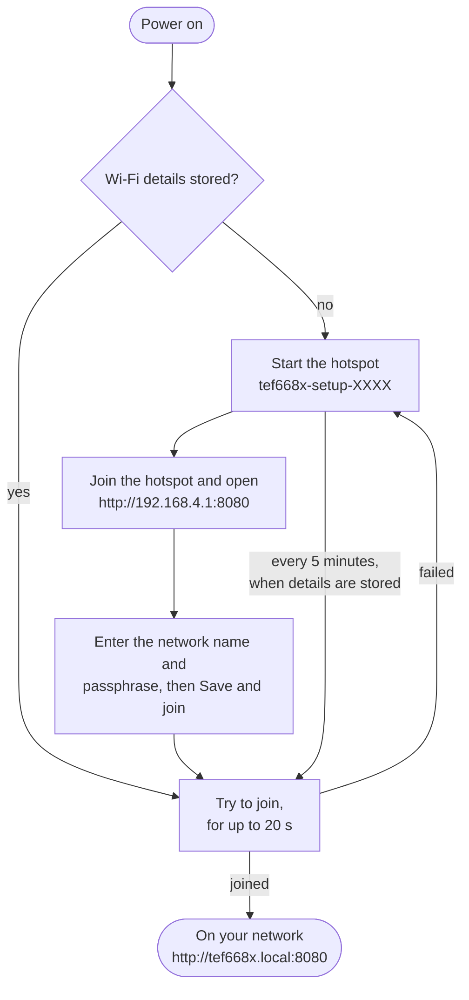

# First Start and Wi-Fi

What the radio does when it starts for the first time, and how to put it on your Wi-Fi.

## The boot screen

At every start the radio runs a short self test and shows each check as it is done.

The top line shows `TEF668X` and the radio, `ATS125`. The amber banner under it shows the tuner chip and the firmware version, for example `TEF6686 v0.1.0`, or `---` until the tuner answers. A check shows a tick when it passed, a cross when it failed, and `-` while it is still waiting. A check with a value, such as the number of presets, shows the value instead: in red when the check failed.

| Check | What it means |
|---|---|
| Settings | The stored settings were read. `New` means the radio started with its defaults, which is normal on the first start. `New` in red means the stored settings could not be read |
| Tuner | The tuner answered and took its patch |
| Radio | The radio started on its band and frequency |
| Presets | The stored presets were read. The number is how many there are. A number in red means some could not be read |
| Keypad | The keypad answered. Without it the knob still works |
| Battery | The battery voltage, read once at start up |

A failed check does not stop the start. The radio carries on, so it can still be reached over Wi-Fi and updated.

## Put the radio on your Wi-Fi

With no Wi-Fi stored, the radio starts its own hotspot, so you can give it your network's details.

1. On a phone or a computer, join the Wi-Fi network named `tef668x-setup-XXXX`. `XXXX` is four characters, 0 to 9 and A to F, from the radio's Wi-Fi address, so two radios get different names. The hotspot has no password.
2. Open `http://192.168.4.1:8080` in a browser. Type the address in yourself: the page does not open on its own when you join.
3. The page shows a **Wi-Fi** box. Enter your **Network name** and **Passphrase**. Leave the passphrase empty for an open network. No PIN is needed here, on the setup hotspot.
4. Press **Save and join**. The page says `Saved. The radio is trying that network now.`, and the hotspot stops.
5. Join your own Wi-Fi again on the phone or computer, and open `http://tef668x.local:8080`.

The radio needs a 2.4 GHz network. [Wi-Fi and Hotspot](Wi-Fi-and-Hotspot.md) has the details of how it picks a network. If it cannot join in 20 s, for example because the passphrase was wrong, it starts the hotspot again and you can try again. While it has details stored but cannot join, it tries that network again every 5 minutes, but not while a phone or computer is on the hotspot. The radio works as a radio the whole time.

### If tef668x.local does not open

Some phones and networks do not find names that end in `.local`. Use the radio's address instead. Open the menu with a press of the tuning knob, and go to **Connectivity > Network Info**:

| Row | What it shows |
|---|---|
| Connection Status | `Connected`, `Connecting`, `Hotspot` or `Off` |
| Web Address | The name and port to type in a browser, `tef668x.local:8080` |
| IP Address | The address your router gave the radio, for example `192.168.1.40`. Open `http://192.168.1.40:8080` |
| Wi-Fi Network | The network it is on. On the hotspot this row is **Hotspot Name** |
| Wi-Fi Signal | How strong your Wi-Fi is at the radio |
| MAC Address | The radio's Wi-Fi address, which some routers ask for |

The web server is on port 8080, not 80, so the address always needs `:8080` at the end.

## Change the access PIN

Every change made from a browser or the HTTP API needs the access PIN, and so does an [update](Updating.md). It starts as `000000`, and until you change it the web page's Home and Network pages show a note that the radio is still on its default PIN.

- **On the web page:** open the **Network** page, sign in with `000000`, and enter six digits under **Access PIN**. Press **Change PIN**. It works at once, and every browser has to sign in again, this one too.
- **On the radio:** open the menu and go to **Connectivity > Web PIN**. Set one digit at a time. The new PIN is saved when the sixth digit is set.

## Set the clock

The radio has no clock that keeps time when it is off. It sets its clock from the internet over Wi-Fi, and shows the time at the top of the radio screen once it has it.

**Network Time** is on from the start, and set to UTC. To show your local time, open the menu and go to **Connectivity > Network Time**, and turn the knob to your offset from UTC, for example `+05:30` for India or `-05:00` for New York in winter. It goes from `-12:00` to `+14:00` in steps of 15 minutes. One step below `-12:00` is **Off**, which stops the radio from setting its clock.

The radio does not change the offset for summer time by itself. Change it by hand when the clocks change.
