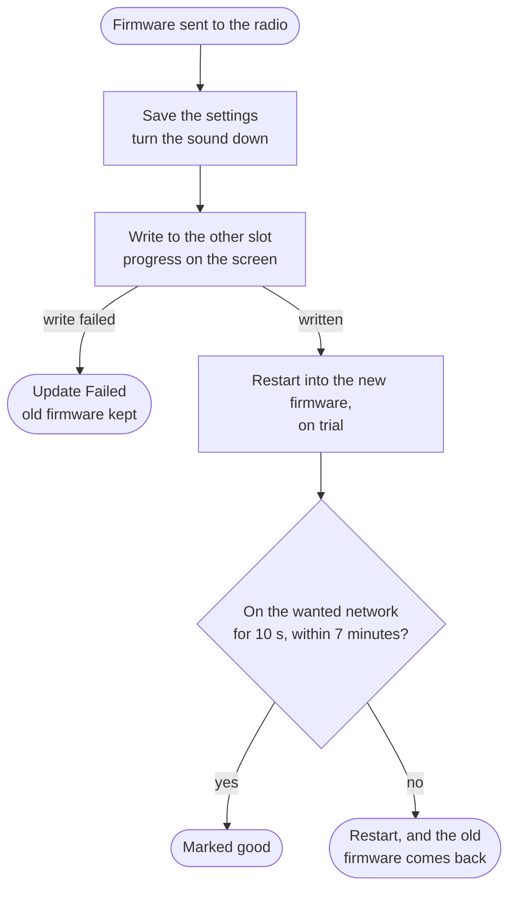

# Updating

After the first install, every update goes over Wi-Fi. No cable and no buttons are needed. The radio keeps the old firmware, and goes back to it by itself if the new one does not work.

There are two ways: the radio can fetch a new release from GitHub by itself when you say yes, or you can send it a firmware file.

Your settings, presets and station log stay as they are.

## From GitHub, on the radio

Turn on **Check for Updates** in the menu at **System**, or on the web page's **Settings** page under **Updates**. It is off on a new radio.

Once the radio is on your Wi-Fi, it looks once on GitHub for a newer release. It does this at every start, and also as soon as the menu closes after you turn the setting on. When it finds one, it offers it in a box on the screen. The box shows the version the radio runs now, the new version, the size of the download, and that your settings are kept:


Turn the knob to move between the two buttons, and press it to take the one that is lit.

- **Update** downloads the new firmware from GitHub, writes it, and restarts into it. The screen shows the progress.
- **Later**, or a hold of the knob, or MODE, closes the offer. After one minute with no answer it closes by itself.

After Later, the update stays in the menu: **System** then shows a row **Update to** and the version, with the size. Press it for the same offer. While nothing newer is known, the row is called **Firmware Update** and says why: `Up to date`, `Not checked`, `Checking`, `Check failed`, or `Off`.

The radio waits to look until it is on your network (not on its own hotspot), a new firmware has passed its trial, and the radio screen is up on its own: no scan or sweep, no menu, DX mode, RDS page or bandwidth page, and no message on the screen. A check takes a few seconds. While it runs, the line under the amber panel says `Checking for updates…` in place of the radio text, the radio goes on answering keys, and the System row says `Checking`. If you open the menu or another page before it ends, the offer waits until you are back on the radio screen. A station scan, a DX scan or a DX level sweep started during the check is refused (the menu says `Radio busy - try again`, the DX Scanner `Checking For Updates`), because the Wi-Fi sending raises the signal levels the radio reads; start it again when the check is over.

 If GitHub cannot be reached, no offer is shown, the System row says `Check failed`, and the radio tries again at the next start.

Before it writes anything, the radio checks the release: it must be for this radio, from this repository's releases, and newer than the firmware it runs, and the download's size must match. The sha256 of the download is checked as it is written to the free slot; if it does not match, that slot is never used. Either way the old firmware keeps running. The usual rollback check runs on the new firmware too, as below.

The web page's **System** page also shows what the check found, with an **Install** button, and a script can install it with `POST /update/install`. See [HTTP API](HTTP-API.md).

## From a file

You need the new firmware file. Download `firmware-ats125.bin` from the latest release on the [Releases page](https://github.com/zeevy/tef668x-esp32/releases), or build your own: `pio run -e ats125` writes it to `.pio/build/ats125/firmware.bin`. Do not use `firmware-ats125-full.bin` here: that file is for a first install over USB.

### From the web page

1. Open the radio's web page, `http://tef668x.local:8080`, and go to the **System** page.
2. Sign in with your access PIN.
3. Under **Firmware**, pick the `.bin` file and press **Upload and reboot**.

The upload takes about 20 seconds. When it is written, the page says `Update written` and the radio restarts into the new firmware.

### With curl

Sign in once, which stores a session cookie in the file `jar`, then send the file:

```bash
R=http://tef668x.local:8080
curl -s -c jar -d pin=000000 $R/auth
curl -s -b jar -F firmware=@firmware-ats125.bin $R/update
```

Use your own PIN in place of `000000`, and the path to your own build in place of `firmware-ats125.bin` if you built it. The radio answers with a short page:

| Answer | What it means |
|---|---|
| 200, `Update written` | The image is written. The radio restarts into it |
| 403, `Enter the access PIN first.` | Not signed in. Run the `/auth` line again |
| 400, `Nothing uploaded` | The request had no file in it |
| 500, `Update failed` | The image was not accepted. The radio is still running the old one |

The session is lost when the radio restarts, so sign in again before the next update.

## What the screen shows

When the upload starts, the radio saves what it is tuned to, turns the sound down, and shows the progress:


Keep the radio powered until it restarts. If the write fails, the screen shows **Update Failed** and **Previous firmware kept** for a few seconds, and the radio goes back to playing with the old firmware.


## Rollback: when the new firmware does not work

The radio has two firmware slots. A new firmware is written to the slot that is not running, and starts on trial. It must be on the network its settings ask for, and stay there for 10 seconds, within 7 minutes of starting. That proves the next update can still reach it. Then it is marked good. If it does not manage that, or if it crashes before, the radio restarts and goes back to the old firmware by itself.



The wanted network depends on the Connectivity settings:

| Settings | The new firmware must be |
|---|---|
| Hotspot on Auto, the usual case | Joined to your Wi-Fi. Falling back to the setup hotspot does not count, because then the next update could not reach it |
| Hotspot set to On | Serving its hotspot |
| Hotspot set to Off | Joined to your Wi-Fi |
| Wi-Fi set to Off | On no network. It is marked good after 10 seconds |

The 7 minutes leave time for a second try at your network, so a router that is down for a moment does not throw away a good firmware.

While the new firmware is on trial, **Menu > System > Restart Radio** does not restart it, and says `Update on trial - wait`, because a restart then would bring the old firmware back.

## Check which firmware is running

- **Menu > About > Firmware Version** shows the version, and **Build** shows the git commit it was built from.
- **Menu > Diagnostics > Boot Source** shows which slot it started from, `app0` or `app1`. **Reset Reason** says `Update` after an update, and `Rollback` after a new firmware did not pass its check in time and the old one came back.
- The **System** page shows the firmware, the slot it runs from, and the **Image**: `confirmed`, or `on trial, waiting for the self check`.

## Go back to the firmware before

To go back to the older firmware by hand, use the [recovery screen](Recovery-Screen.md): hold the tuning knob down while you switch the radio on, choose **Restore Previous Firmware**, and press again to confirm. The row shows `None` when there is no older firmware to go back to, as after an install over USB.
