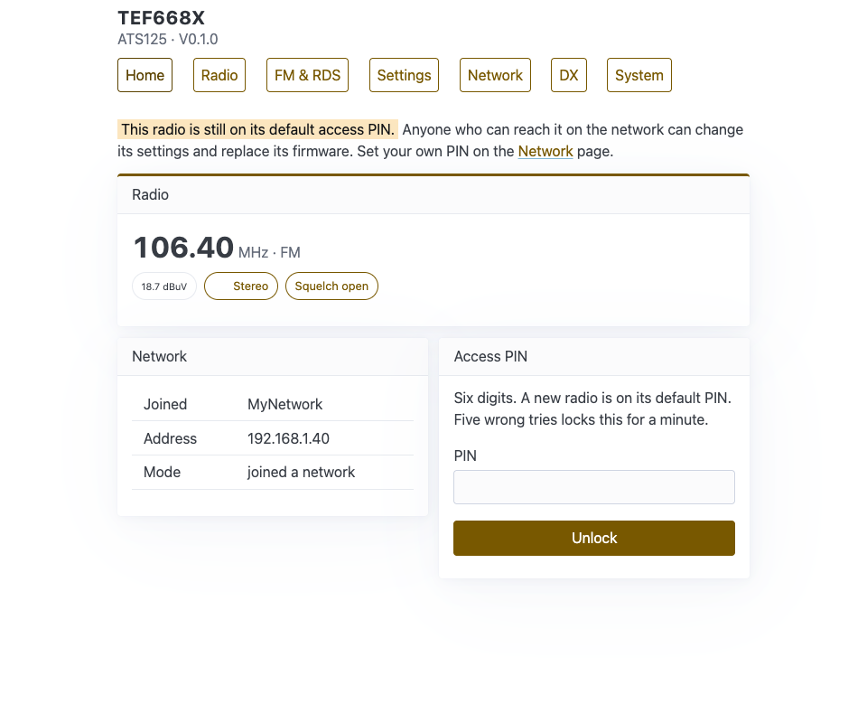
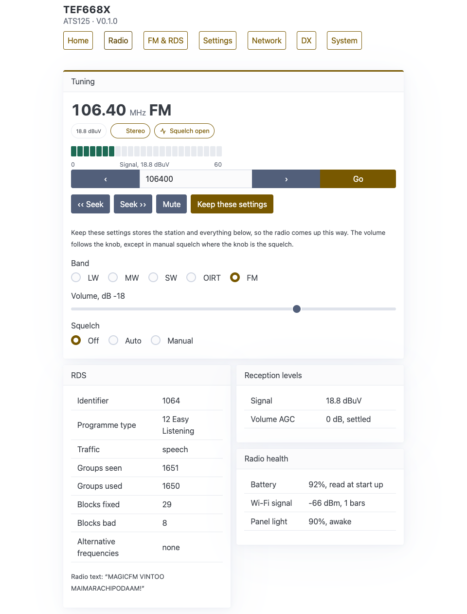
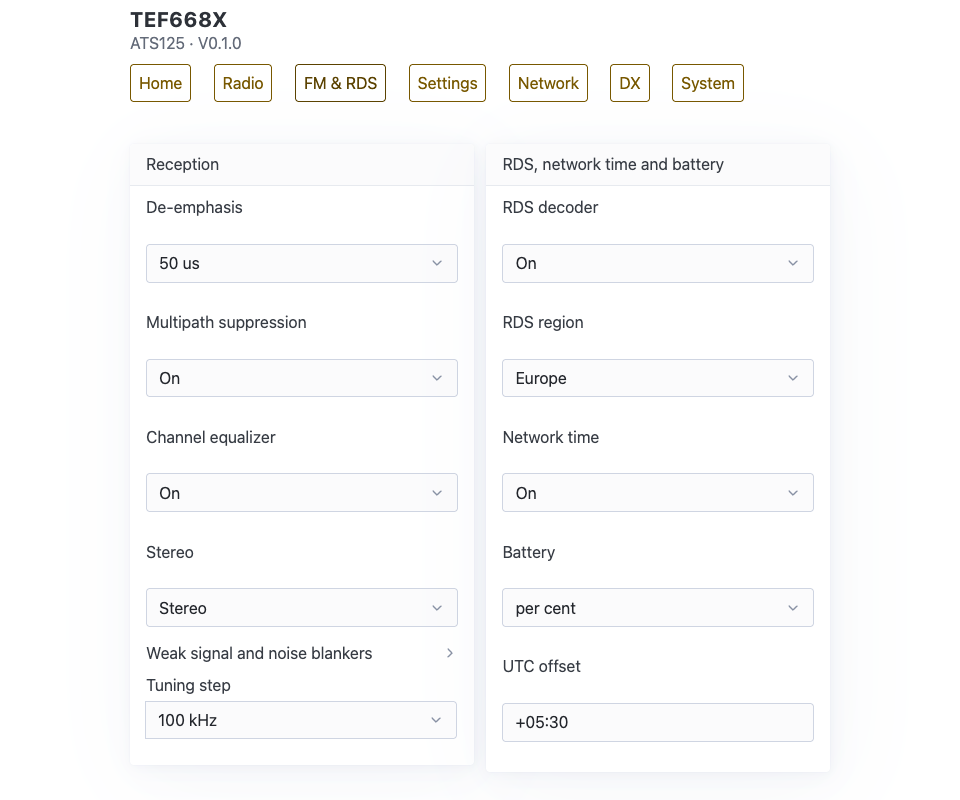
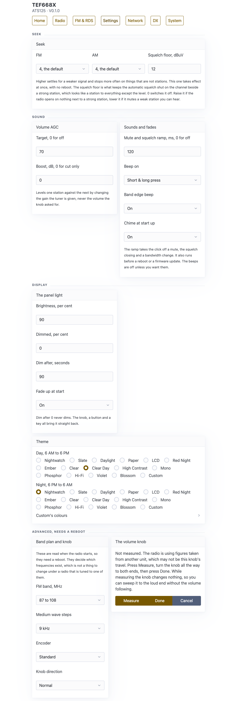
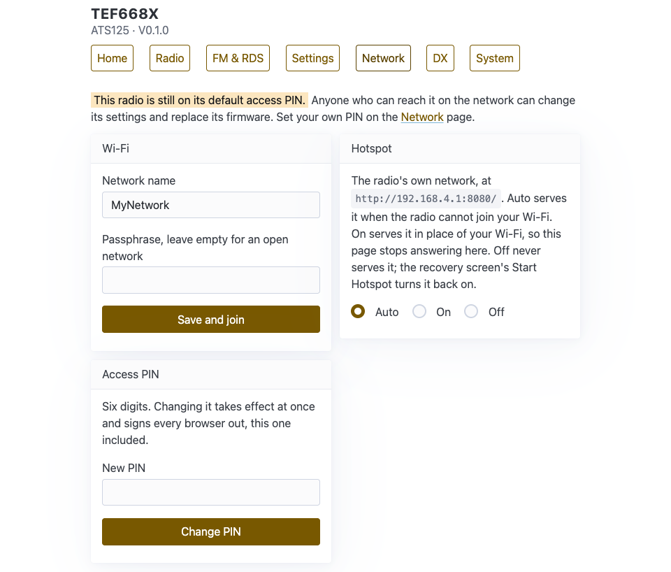
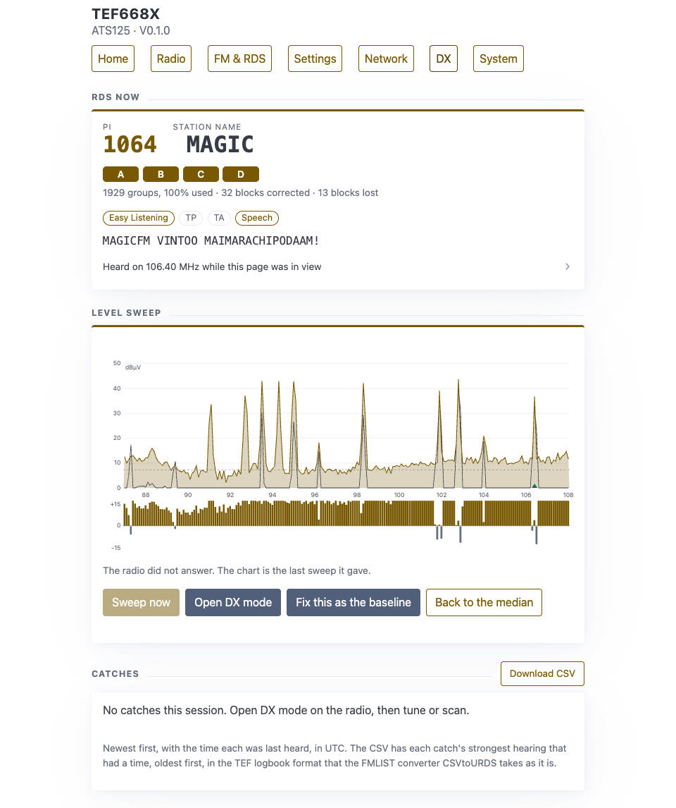
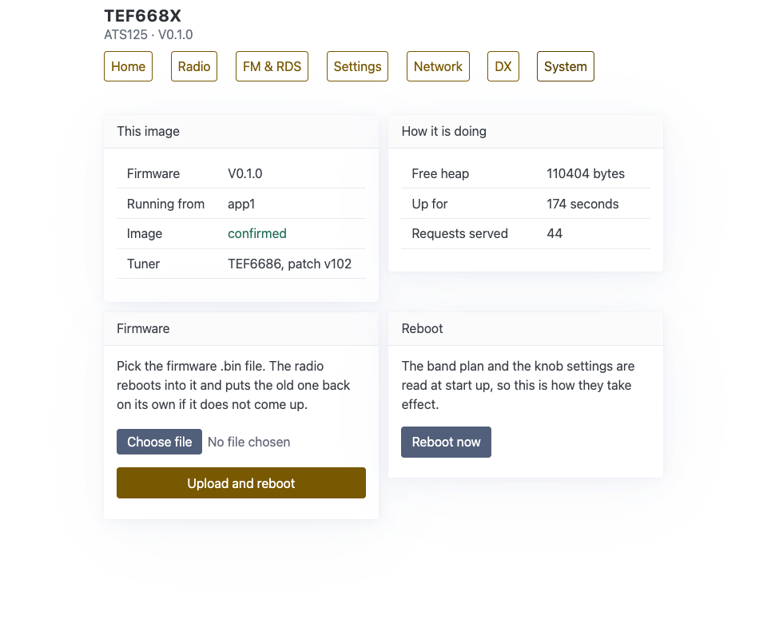

# Web Page

The radio serves its own web page, so you can control it from a phone or a computer on the same network. Open `http://tef668x.local:8080`. If the name does not open, see [First Start and Wi-Fi](First-Start-and-Wi-Fi.md#if-tef668xlocal-does-not-open).

No internet is needed: the page and everything it uses come from the radio itself. The page follows your browser's light or dark setting, not the radio's theme.

In the pictures on this page the network name and address are placeholders.

## Pages

The buttons at the top lead to seven pages:

| Page | Address | Needs the PIN | What it is for |
|---|---|---|---|
| Home | `/` | No | What the radio is playing, and the network |
| Radio | `/radio` | Yes | Tuning, band, volume and squelch, with RDS and signal readings |
| FM & RDS | `/fm` | Yes | The reception settings, RDS, network time and the battery mark |
| Settings | `/settings` | Yes | Seek, sound, display, themes, and the settings read at start up |
| Network | `/network` | To save, except on the setup hotspot | Wi-Fi, the hotspot and the access PIN |
| DX | `/dx` | Yes | RDS as it arrives, the band sweep chart and the DX catches |
| System | `/system` | Yes | The firmware, updates and reboot |

On the Radio, FM & RDS, Settings and DX pages, and for the Hotspot on the Network page, a change takes effect the moment you make it, and the radio's answer shows in a small note at the bottom of the screen. If the radio refuses a change, for example because your sign in has run out, the note is red and says why, and the field goes back to what the radio has. The Wi-Fi, PIN, firmware and reboot buttons, and a refused sign in, open a short result page instead.

## Signing in

A page that needs the PIN shows the **Access PIN** box instead. Enter the six digits and press **Unlock**. The browser comes back to the same page.

- The PIN starts as `000000`. Until you change it, Home and Network show a note that the radio is still on its default access PIN.
- A sign in lasts 30 minutes. Using the page does not make it longer.
- Only one browser can be signed in at a time. Signing in on another one signs the first out.
- After five wrong PINs, signing in is locked for one minute, for every browser.
- A restart of the radio, a change of the PIN, or turning the web server off signs you out. There is no sign out button.

## Home

The **Radio** box shows the frequency and band, and small marks for the signal level, stereo, the squelch and mute. It is read once when the page opens. Signed in, a **Tune and settings** button leads to the Radio page.

The **Network** box shows the network the radio joined, its address, and whether it is on your network or serving its own hotspot. On the setup hotspot this page also shows the Wi-Fi form.

## Radio

**Tuning:**

- The frequency, the marks, and a signal meter from 0 to 60 dBµV on FM, or to 45 on AM.
- `‹` and `›` step down and up. Type a frequency in kHz in the box, such as `98500` for 98.50 MHz, and press **Go**.
- **‹‹ Seek** and **Seek ››** seek down and up. The frequency updates while it seeks.
- **Mute** turns mute on and off. There is no mute key on the radio itself.
- **Keep these settings** stores the station and the settings, so the radio starts this way.
- **Band**: LW, MW, SW, OIRT, FM. The page reloads after a band change.
- **Volume, dB**: a slider from -60 to 0. The next turn of the volume knob replaces it.
- **Squelch**: Off, Auto, Manual.

**RDS** shows the Identifier (the PI), the programme type, traffic and speech or music, counts of the RDS groups and blocks, how many alternative frequencies were heard, and the radio text. **Reception levels** shows the signal and the volume AGC. **Radio health** shows the battery, the Wi-Fi signal and the screen light.

The frequency and band update when the page opens, after each change you make on it, and while a seek runs. A turn of the knob on the radio does not show until then. Reload the page to update the rest.

## FM & RDS

**Reception** has the settings of [Sound and Bandwidth](Sound-and-Bandwidth.md): de-emphasis, and on FM multipath suppression, the channel equaliser and stereo or mono. **Weak signal and noise blankers** opens the high cut and blend levels and both noise blankers, and the AM high cut and soft mute. On AM it also has the filter **Bandwidth**. **Tuning step** offers the steps of the band you are on.

**RDS, network time and battery**: the RDS decoder, the RDS region, network time, the battery mark in the radio's header, and the **UTC offset**, written like `+05:30`.

## Settings

| Section | What is in it |
|---|---|
| Seek | Seek sensitivity for FM and for AM, from 1 (strong only) to 6 (finds weak ones), and the squelch floor |
| Sound | The volume AGC target and boost. The mute and squelch ramp, which presses beep, the band edge beep, and the chime at start up |
| Display | Brightness, the dimmed level, how many seconds before it dims, and the fade at start. Touch, on or off, and the keypad timeout. The day and night themes, and **Custom's colours**, eight of the custom theme's colours (a ninth, for a header, is stored but drawn nowhere) |
| Updates | **Check for updates**: Off or On. See [Updating](Updating.md#from-github-on-the-radio) |
| Advanced, needs a reboot | The FM band plan, the medium wave steps, the encoder type and the knob direction. These take effect after a reboot |
| The volume knob | **Measure**, **Done** and **Cancel** teach the radio the two ends of the volume knob's travel |

## Network

- **Wi-Fi**: the network name and passphrase, and **Save and join**. The radio moves to that network at once. The stored name shows only when you are signed in, or on the setup hotspot.
- **Hotspot**: Auto, On or Off. Choosing a value saves it at once, and the radio's answer shows in the note at the bottom of the screen. A change can move the radio between your Wi-Fi and its own hotspot, and then the page stops answering at the address you used: On while you are on your Wi-Fi, or Off or Auto while you are on the hotspot. See [Wi-Fi and Hotspot](Wi-Fi-and-Hotspot.md).
- **Access PIN**: enter six digits and press **Change PIN**. It takes effect at once and signs every browser out.

Not signed in, the page shows the Wi-Fi form and the sign in box.

## DX

- **RDS now**: the PI, the station name, the four blocks, the programme type, country, call sign, TP, TA, speech or music, and the radio text. It updates every second. A folded list, **Heard on** the frequency **while this page was in view**, keeps up to 8 PIs heard, and starts again when you tune or come back to the tab.
- **Level sweep**: a chart of the last band sweep, with the baseline, the highest level, the floor and the dial, and a strip of the rise over the baseline. Point at the chart to read a channel, and click to tune there. **Sweep now** sweeps, in DX mode only. **Open DX mode** opens it. **Fix this as the baseline** keeps this sweep as the baseline, and **Back to the median** returns to the usual one.
- **Catches**: the DX catches, with a NEW mark, the level, how many times heard and when. **Log** writes a catch to the station log, **Log again** writes it again, and `✓ logged` marks one already written. **Download CSV** gives the file for FMLIST. It updates every 5 seconds.

See [DX Mode](DX-Mode.md). The page asks nothing while its browser tab is hidden.

## System

- **This image**: the firmware version, the slot it runs from, whether it is confirmed or still on trial, and the tuner.
- **How it is doing**: free memory, how long it has been up, and how many requests it has served.
- **Firmware**: pick a `.bin` file and press **Upload and reboot**. See [Updating](Updating.md).
- **From GitHub releases**: what the update check found. While a newer release is known it shows the version and size, and **Install** asks first, then installs it from GitHub.
- **Reboot**: **Reboot now** asks first, then restarts the radio. It is refused while a new firmware is on trial.

## What the web page does not do

These are on the radio or the [HTTP API](HTTP-API.md) only: presets and their CSV files, viewing the station log, station scans, sleep, the FM filter width, the DX Scanner settings, the screen rotation, the level offsets, Auto Off, and turning Wi-Fi or the web server off.

The web server answers nothing during a DX level sweep, about 4 seconds. A request made then is answered when the sweep ends.
