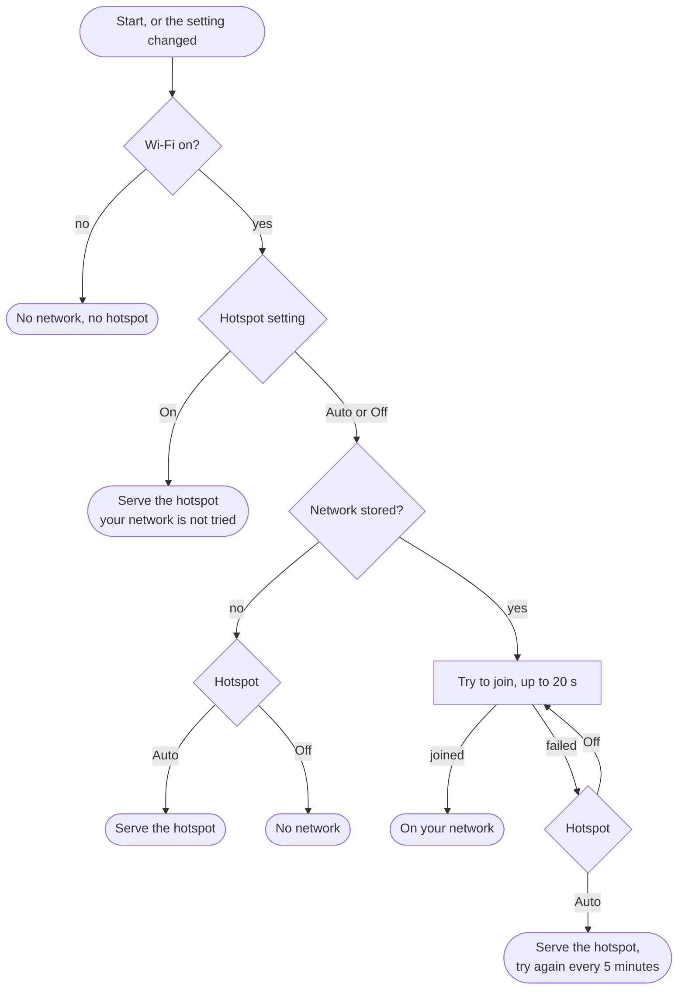

# Wi-Fi and Hotspot

How the radio decides which network to be on, and what the three Connectivity switches do. For the first setup, see [First Start and Wi-Fi](First-Start-and-Wi-Fi.md).

## The three switches

All three are in the menu at **Connectivity**. Each acts when you press to save it.

| Row | Values | New radio | What it does |
|---|---|---|---|
| Wi-Fi | On, Off | On | Off turns Wi-Fi off altogether: no network and no hotspot |
| Hotspot | Auto, On, Off | Auto | When the radio serves its own network, `tef668x-setup-XXXX` |
| Web Server | On, Off | On | The web page, the HTTP API and updates over Wi-Fi |

### Hotspot

| Value | What it does |
|---|---|
| **Auto** | The radio joins your network. It serves its own hotspot only when it has no network stored, or cannot join the one stored |
| **On** | The radio always serves its hotspot, in place of your network. Your network is not tried at all |
| **Off** | The radio never serves the hotspot. It tries your network again and again. With no network stored, it is on no network |

Change it in the menu at **Connectivity > Hotspot**, on the web page's **Network** page, or with `hsp` in [POST /api/settings](HTTP-API.md#post-apisettings).

On Auto, while the hotspot is up because your network could not be joined, the radio tries your network again every 5 minutes. It does not try while a phone or computer is on the hotspot, since that person is probably typing the details in.

If your network drops for more than a moment while the radio is on it, for example when the router restarts, the radio gives it up. On Auto it then serves the hotspot and tries your network again after 5 minutes.

While the web server is on, the radio announces its name, `tef668x.local`, on your network and on its hotspot.

## Joining a network

The radio takes one network. Give it the name and the passphrase in one of these ways:

- **On the setup hotspot**, on the page at `http://192.168.4.1:8080`. No PIN is needed there.
- **On the web page's Network page**, while on your network. Saving needs the access PIN.
- **From the API**: `POST /api/settings` with `sid` (the network name) and `pwd` (the passphrase), with the access PIN.

The name can be up to 32 characters and the passphrase up to 64. Leave the passphrase empty for an open network. The network must be on 2.4 GHz.

Saving new details makes the radio try that network at once. If Hotspot was On, saving a network sets it back to Auto.

## When the hotspot is On

The hotspot has no password, so anyone in range can join it and reach the web page. With Hotspot set to On, the Wi-Fi form there needs the access PIN, so a passer-by cannot move the radio to another network. Keep your own PIN set.

Use On when you take the radio somewhere without your network, and want to reach its web page from a phone.

## Turning Wi-Fi or the web server off

- **Wi-Fi Off** stops the network and the hotspot. The web page, the API, updates over Wi-Fi and the network clock all stop with it.
- **Web Server Off** keeps the radio on the network, so the clock still sets, but stops the web page, the API and updates over Wi-Fi.
- **Wi-Fi Off** also closes the [PC Link](PC-Tools.md). Web Server Off does not: the PC Link has its own switch.

Both can be turned off from the HTTP API (`wif=0` and `web=0` in `POST /api/settings`), but only the radio's menu turns them back on, or **Erase Settings** on the recovery screen. So turning either off from a script cuts the script off.

The radio works as a radio with Wi-Fi off. Turning Wi-Fi off also lets it read the battery every second, since Wi-Fi uses the part of the chip that reads it.

## Lost access

| Problem | Way back |
|---|---|
| The stored network is gone, Hotspot is Auto | The radio serves the setup hotspot by itself within 20 s. Enter the new details there |
| The stored network is gone, Hotspot is Off | Set Hotspot to Auto in the menu. Or use **Start Hotspot** on the [recovery screen](Recovery-Screen.md) |
| Wi-Fi or Web Server was turned off | Turn it on in the menu, at Connectivity |
| The screen cannot be read | The recovery screen: hold the tuning knob down at power on |

## Network Info

**Connectivity > Network Info** shows the connection: Connection Status, Web Address, IP Address, Wi-Fi Network (Hotspot Name while serving the hotspot), Wi-Fi Signal and MAC Address. See [First Start and Wi-Fi](First-Start-and-Wi-Fi.md#if-tef668xlocal-does-not-open).
